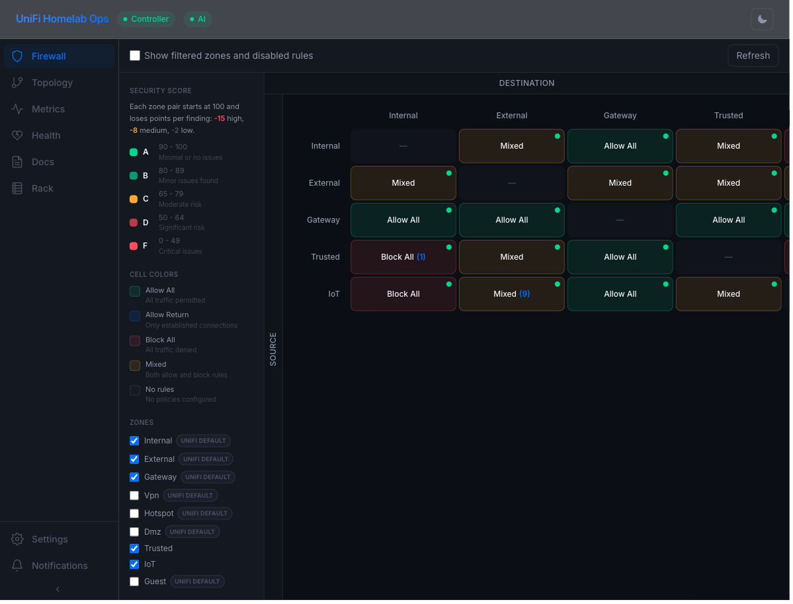
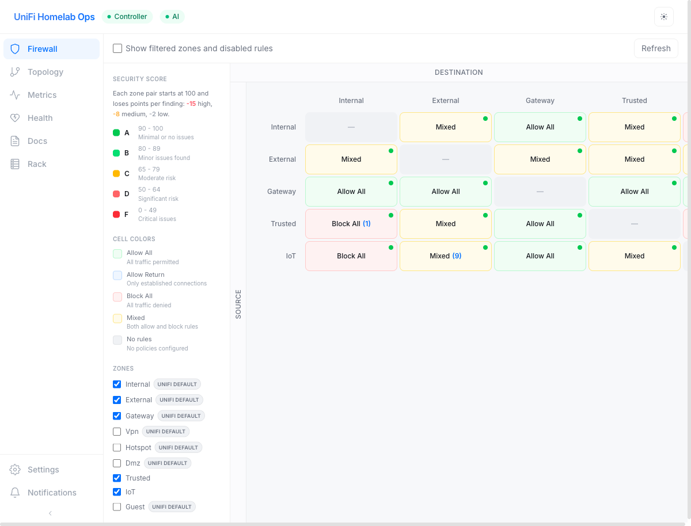
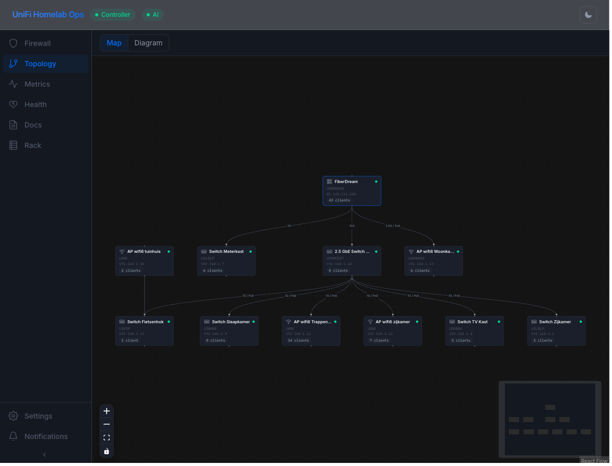
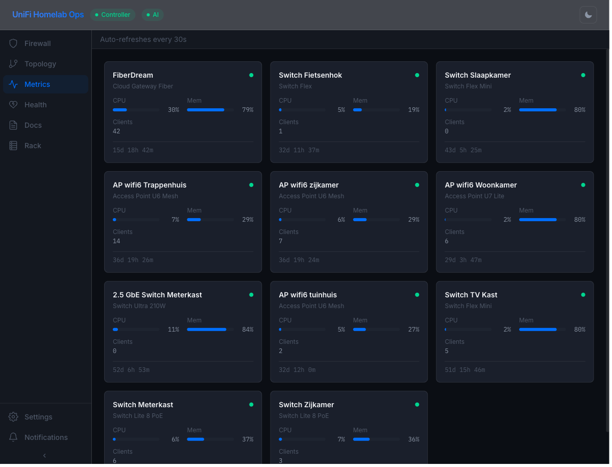
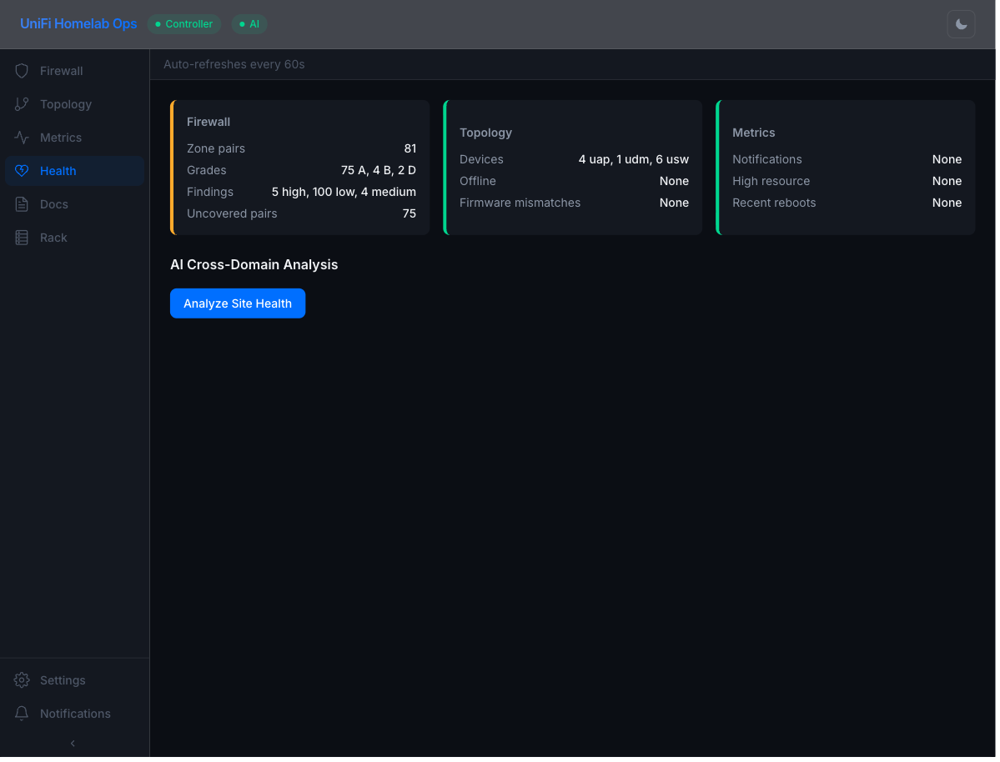
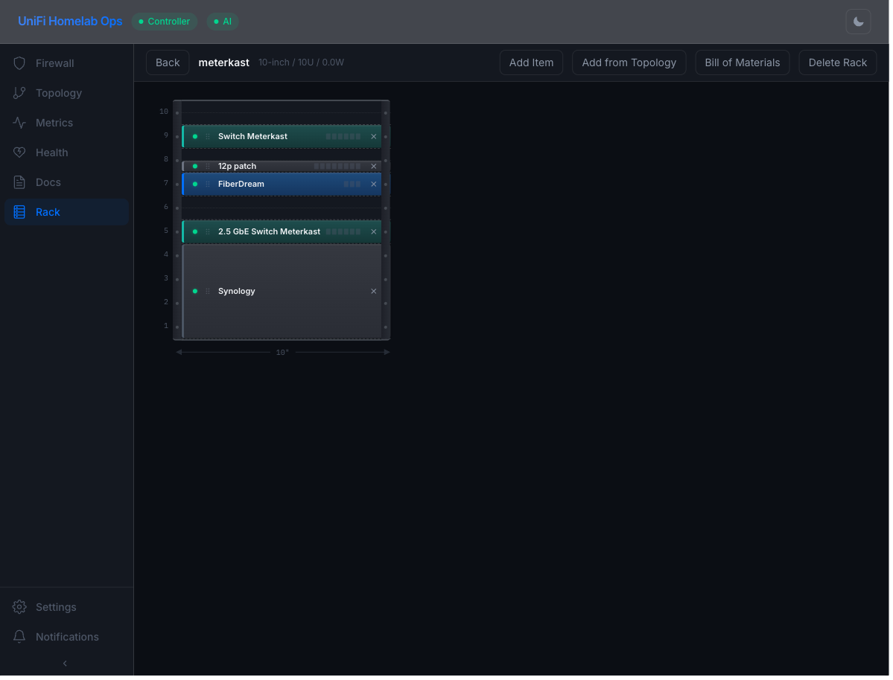

# UniFi Homelab Ops

[](https://github.com/merlijntishauser/unifi-homelab-ops/actions/workflows/ci.yml)
[](https://github.com/merlijntishauser/unifi-homelab-ops/actions/workflows/docker-publish.yml)
[](https://hub.docker.com/r/merlijntishauser/unifi-homelab-ops)
[](LICENSE)

**Your UniFi controller is powerful. This makes it *visible*.**

A self-hosted companion app for homelab enthusiasts who want deeper visibility into their UniFi network -- firewall analysis, live topology maps, device metrics, rack planning, and AI-powered health assessments. All from a single pane of glass, running on your own hardware.



## Why?

The native UniFi dashboard is great for day-to-day management, but it doesn't answer questions like:

- *"Which zone pairs have no explicit firewall rules?"*
- *"Are any of my rules shadowed or overlapping?"*
- *"What does my network actually look like, right now?"*
- *"Is anything running hot, and has it been for a while?"*
- *"Will all my gear fit in a 10-inch rack?"*

UniFi Homelab Ops fills those gaps. Connect to your controller, and within seconds you have a full security audit, live topology, device monitoring, and a visual rack planner -- all with dark mode, mobile support, and optional AI analysis.

## Modules

### Firewall Analysis

See every zone-to-zone relationship at a glance. Each cell is color-coded by policy type and scored A-F with 11 automated security checks. Click any cell to drill into the interactive rule graph, inspect individual rules, or simulate traffic flows.

- Zone matrix with automatic security grading (A-F)
- Interactive ReactFlow graph with rule badges and step paths
- Traffic simulator -- trace which rule matches a given source/destination/port
- Rule management -- enable/disable and reorder rules directly
- Optional AI deep analysis via OpenAI, Anthropic, or any compatible API



### Network Topology

Interactive device map showing every connection, port status, and LLDP neighbor. Switch to the SVG diagram view for a clean orthogonal or isometric rendering you can export as SVG or PNG.



### Device Metrics

Real-time monitoring for every UniFi device. CPU, memory, temperature, traffic, PoE consumption -- all on auto-refreshing cards with sparkline trends. Click any device for detailed time-series charts and notification history.

Automatic anomaly detection alerts you to high CPU, memory pressure, temperature spikes, PoE overload, and unexpected reboots.



### Site Health

Aggregated status cards from all modules with colored health indicators. One-click AI cross-domain analysis correlates firewall posture, topology risks, and metric anomalies to surface issues no single module can detect.



### Rack Planner

Design your homelab rack layout with drag-and-drop device placement. Supports 10" and 19" racks, fractional U heights (0.5U), fractional widths (quarter/half/full), and auto-populates device specs from the UniFi catalog. Generate a bill of materials or import devices directly from your controller.



### Documentation Generator

Auto-generate network documentation from live controller data: Mermaid topology diagrams, device inventories, port overviews, LLDP neighbor tables, firewall summaries, and metrics snapshots. Export as Markdown, JSON, SVG, or PNG.

## Quick Start

### Prerequisites

- [Docker](https://docs.docker.com/get-docker/)
- A UniFi Network controller (9.x or later)

### One command

```bash
docker run -d \
  --name unifi-homelab-ops \
  -p 8080:8080 \
  -v unifi-homelab-ops-data:/data \
  merlijntishauser/unifi-homelab-ops:latest
```

Open [http://localhost:8080](http://localhost:8080) and log in with your UniFi controller credentials.

### With environment credentials

```bash
docker run -d \
  --name unifi-homelab-ops \
  -p 8080:8080 \
  -v unifi-homelab-ops-data:/data \
  -e UNIFI_URL=https://192.168.1.1 \
  -e UNIFI_USER=admin \
  -e UNIFI_PASS=yourpassword \
  merlijntishauser/unifi-homelab-ops:latest
```

### Docker Compose

```yaml
services:
  unifi-homelab-ops:
    image: merlijntishauser/unifi-homelab-ops:latest
    ports:
      - "8080:8080"
    volumes:
      - unifi-homelab-ops-data:/data
    environment:
      - UNIFI_URL=https://192.168.1.1
      - UNIFI_USER=admin
      - UNIFI_PASS=yourpassword
    restart: unless-stopped

volumes:
  unifi-homelab-ops-data:
```

## Configuration

| Variable | Description | Default |
|---|---|---|
| `UNIFI_URL` | Controller URL (e.g. `https://192.168.1.1`) | -- |
| `UNIFI_SITE` | Site name | `default` |
| `UNIFI_USER` | Controller username | -- |
| `UNIFI_PASS` | Controller password | -- |
| `UNIFI_VERIFY_SSL` | Verify SSL certificates | `false` |
| `APP_PASSWORD` | Optional passphrase gate for the web UI | -- |
| `APP_SESSION_TTL` | Session duration in seconds | `86400` |
| `HOMELAB_OPS_DB_PATH` | SQLite database path | `/data/homelab-ops.db` |
| `LOG_LEVEL` | Server log level | `INFO` |

All `UNIFI_*` variables are optional -- if omitted, log in through the UI after startup. Runtime credentials take priority over environment variables. Mount `/data` to persist settings, cached analysis, and metrics history.

### AI Analysis (optional)

Configure via the Settings modal in the app, or via environment variables:

| Variable | Description | Default |
|---|---|---|
| `AI_BASE_URL` | Provider API base URL | -- |
| `AI_API_KEY` | API key | -- |
| `AI_API_KEY_FILE` | Path to file containing the API key (Docker secrets) | -- |
| `AI_MODEL` | Model name (e.g. `gpt-4o`, `claude-sonnet-4-6`) | -- |
| `AI_PROVIDER_TYPE` | `openai` or `anthropic` | `openai` |

Works with any OpenAI-compatible API (OpenAI, Ollama, LM Studio, etc.) and the Anthropic API.

## Docker Images

Published to [Docker Hub](https://hub.docker.com/r/merlijntishauser/unifi-homelab-ops) on every push to `main` and on version tags.

| Tag | Description |
|---|---|
| `latest` | Latest release or main branch build |
| `1.0.0`, `1.0`, `1` | Pinned release version |
| `alpine` | Alpine variant (smaller image) |
| `1.0.0-alpine` | Alpine variant of pinned release |

Multi-arch: `linux/amd64` and `linux/arm64`.

## Tech Stack

| Layer | Stack |
|---|---|
| Backend | Python 3.13, FastAPI, SQLite, [unifi-topology](https://github.com/merlijntishauser/unifi-topology) |
| Frontend | React 19, TypeScript, Tailwind CSS 4, ReactFlow |
| Infra | Docker, Vite, uv |

## Contributing

See [CONTRIBUTING.md](CONTRIBUTING.md) for development setup, architecture, quality standards, and release process.

## License

[MIT](LICENSE)
